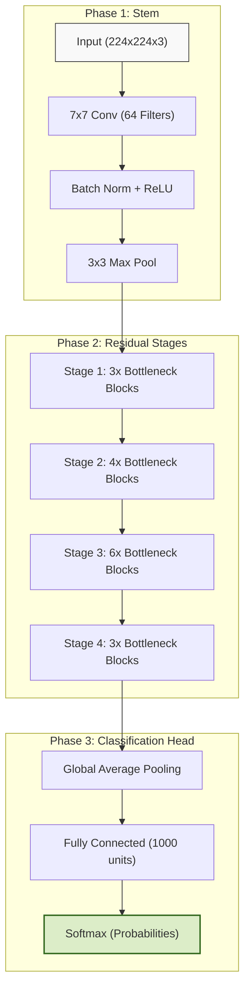

# 🍎 Fruit Quality Detector: Technical Architecture & Dual-Engine AI

[](https://www.python.org/)
[](https://tensorflow.org/)
[](https://streamlit.io/)

---

## 📖 Introduction
The **Fruit Quality Detector** is a high-performance computer vision application. It solves the critical task of distinguishing between **Good** and **Spoiled** produce by analyzing visual features such as skin texture, color uniformity, and surface defects.

---

## 🧠 Core Concept: Convolutional Neural Networks (CNN)

### **What is a CNN?**
A **Convolutional Neural Network** is a deep learning architecture inspired by the human visual cortex. Unlike standard neural networks that see images as a flat list of pixels, a CNN understands **spatial hierarchies** (edges → shapes → objects).

#### **The 4 Key Layers in our CNN:**
1.  **Convolutional Layer**: Uses "filters" to scan the image. It acts like a magnifying glass looking for specific patterns (like a brown spot on an apple).
2.  **Activation (ReLU)**: Adds non-linearity. It decides which features are "important" enough to pass to the next layer.
3.  **Pooling (Max Pooling)**: Reduces the image size while keeping the most important information. This makes the model faster and more robust to image rotation.
4.  **Dense (Fully Connected)**: The final "brain" that takes all the extracted features and makes the final decision: *Is this a good orange or a spoiled one?*

---

## 🏛️ Custom Model: MobileNetV2 Backbone

### **What is a "Backbone"?**
In deep learning, a **Backbone** is a pre-trained model that acts as a "Feature Extractor." We use **MobileNetV2** as our backbone. It has already "seen" millions of images (ImageNet) and knows how to recognize shapes, colors, and textures.

*   **Why MobileNetV2?**: It is designed for speed. It uses *Depthwise Separable Convolutions* to provide high accuracy while using very little memory.
*   **The Custom Head**: We removed the original classification layer of MobileNetV2 and added our own **Custom Layers** (Dense, Dropout, Softmax) to specifically detect fruit quality.

---

## 🧬 ResNet-50: Residual Architecture

### **Advanced Architecture Breakdown**
ResNet (Residual Network) is famous for its **Skip Connections**. 

Standard networks try to learn the full mapping $H(x)$. ResNet instead learns the "Residual" $F(x) = H(x) - x$. This allows the network to effectively "bypass" layers if they aren't helping, which prevents the **Vanishing Gradient Problem** (where the model stops learning because it's too deep).

#### **ResNet-50 Data Flow Diagram**


---

## 📊 Models Table: Side-by-Side

| Feature | Custom CNN (MobileNetV2) | ResNet-50 |
| :--- | :--- | :--- |
| **Logic** | Specialized Fine-Tuning | Pre-trained Generalist |
| **Architecture** | Depthwise Separable Conv | Residual Skip Connections |
| **Primary Goal** | **Fruit Freshness** | **General Object Identity** |
| **Performance** | High Accuracy on this Dataset | Baseline Comparisons |

---

## 🚀 Setup & Execution

> [!NOTE]
> Ensure you have **TensorFlow 2.15.0** installed for maximum compatibility with the `.h5` model files.

```bash
# Install dependencies
pip install -r requirements.txt

# Start the Streamlit server
streamlit run app.py
```

---

<p align="center">
  <b>Developed for professional fruit quality assessment using Deep Learning.</b>
</p>
