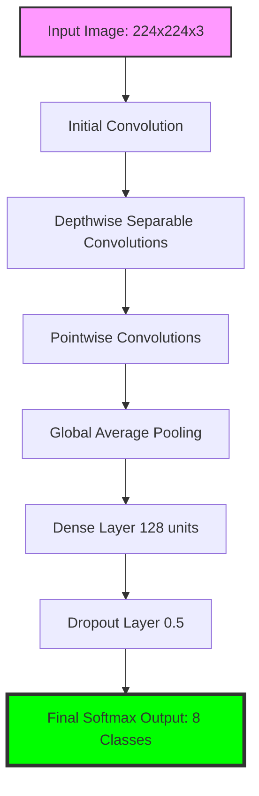

# Fruit Quality Detector

## Overview
Fruit Quality Detector is a web application that uses a machine learning model to classify fruits as either **Good** or **Spoiled**. This project demonstrates how TensorFlow and Keras can be used to build and deploy a fruit classification system on Streamlit.


## Hosted App
The application is live and hosted at:
[https://fruit-classify.onrender.com/](https://fruit-classify.onrender.com/)

## Key Learning
To successfully deploy this app on Streamlit, use TensorFlow and Keras version **2.15.0**.

## ✨ Features
- **Real-time Classification**: Instantly detect if a fruit is fresh or spoiled.
- **Multi-Fruit Support**: Specialized detection for Bananas, Apples, Oranges, and Pomegranates.
- **Interactive Sidebar**: Easy access to sample images for quick testing.
- **User-Friendly Interface**: Clean and intuitive web UI built with Streamlit.
- **Confidence Scoring**: View the model's certainty level for every prediction.

## 🧠 Deep Learning Model (CNN)

This project is built around a powerful **Convolutional Neural Network (CNN)** designed specifically for image classification task. CNNs are a class of deep neural networks, most commonly applied to analyzing visual imagery.

### 🌐 CNN Architecture Overview
The model follows a structured architecture optimized for both accuracy and performance. It leverages **MobileNetV2** as the base architecture, which is known for its efficiency in mobile and web applications.

1.  **Input Layer**: Accepts 224x224 pixel RGB images.
2.  **Convolutional Layers**: These layers use filters (kernels) to extract features like edges, textures, and eventually complex shapes (fruit features).
3.  **Activation Function (ReLU)**: Adds non-linearity to the model, allowing it to learn complex patterns.
4.  **Pooling Layers**: Reduces the spatial dimensions of the data, making the model more robust to small variations in the image.
5.  **Fully Connected (Dense) Layers**: The final layers that perform the classification into the 8 target categories (Good/Spoiled for different fruits).

### 📊 Model Graph
Below is a high-level representation of the model's data flow:



### 🧠 How it Works in this Application
The model doesn't just "see" the image; it processes it through several mathematical transformations:

*   **Preprocessing**: Each uploaded image is resized to **224x224 pixels** and normalized to a range of **[-1, 1]**. This ensures the model receives data in the same format it was trained on.
*   **Feature Extraction**: The early layers of the CNN detect simple features like the color and shape of the fruit. Deeper layers combine these to identify "freshness" markers vs "spoilage" markers (like dark spots or mold patterns).
*   **Classification**: The final layer outputs a probability distribution across 8 classes. The class with the highest probability is selected as the result.

## 🚀 ResNet Integration (Secondary Model)
In addition to our custom-trained model, we have integrated **ResNet50** as a secondary classification engine. This allows for a comparative analysis between a task-specific model and a world-class general-purpose architecture.

### ❓ Why ResNet?
1.  **Baseline Benchmarking**: ResNet50 serves as a powerful baseline. If the custom model identifies a "Spoiled Apple" and ResNet identifies the object as an "Apple," it confirms the custom model's structural understanding.
2.  **Overcoming Vanishing Gradients**: Standard deep networks often suffer from "vanishing gradients," where the signal for learning becomes too small as it's passed back through many layers. ResNet solves this using **Residual Learning**.
3.  **Generalization**: While our custom model is fine-tuned for health/freshness, ResNet is trained on **1,000 different classes** (ImageNet), making it exceptionally good at identifying the base object even in cluttered backgrounds.

### 📐 ResNet Architecture & Skip Connections
The core innovation of ResNet is the **Residual Block**. Instead of trying to learn a direct mapping $H(x)$, the network learns the "residual" $F(x) = H(x) - x$. The original input $x$ is then added back to the output: $H(x) = F(x) + x$.

*   **Skip Connections (Shortcuts)**: These identity mappings allow the network to "skip" layers if they aren't improving performance. This makes ResNet much easier to train at extreme depths.
*   **Bottleneck Design**: ResNet50 uses a "bottleneck" design with 1x1, 3x3, and 1x1 convolutions to reduce computational burden while maintaining high learning capacity.

### 🔢 Types of ResNet
ResNet comes in various "depths," usually defined by the number of weighted layers:
-   **ResNet-18 & ResNet-34**: Shallow versions using "Basic Blocks." Good for simple tasks or edge devices.
-   **ResNet-50**: The industry standard (used in this project). It introduces **Bottleneck blocks** for better performance-to-cost ratio.
-   **ResNet-101 & ResNet-152**: Extremely deep versions used for complex image recognition tasks where high accuracy is paramount.

### 📊 Comparative UI
When you upload an image, the UI now splits the result:
-   **Custom Model**: Provides the specific condition (Good/Spoiled) and fruit type.
-   **ResNet50**: Provides the ImageNet classification (e.g., "Granny Smith," "Banana," "Orange").

### 🔬 Performance Insights: Custom vs. ResNet
> [!IMPORTANT]
> **Observation**: In this project, the **overall response and accuracy of the ResNet50 model is lower than our custom-made model.** 

**Why?**
-   **Specialization**: The Custom Model is trained specifically on the lighting, backgrounds, and specific fruit varieties in this dataset.
-   **Task Focus**: ResNet50 is looking for 1,000 different things. It might get distracted by the grass or rocks in the background.
-   **Class Mismatch**: ResNet might identify an apple as a "Pomegranate" because its training data (ImageNet) has different visual priorities.

### 🛠️ Transfer Learning: Creating Custom ResNet Layers
Yes, it is absolutely possible to create your own custom layers for a ResNet model! This is called **Transfer Learning**. Here is the code structure to do it:

```python
from tensorflow.keras.applications import ResNet50
from tensorflow.keras.layers import Dense, GlobalAveragePooling2D
from tensorflow.keras.models import Model

# 1. Load ResNet50 without the top (1000-class) layer
base_model = ResNet50(weights='imagenet', include_top=False, input_shape=(224, 224, 3))

# 2. Freeze the base layers (so we don't destroy pre-learned features)
for layer in base_model.layers:
    layer.trainable = False

# 3. Add your custom classification layers
x = base_model.output
x = GlobalAveragePooling2D()(x)
x = Dense(1024, activation='relu')(x)
predictions = Dense(8, activation='softmax')(x) # Our 8 Fruit Classes

# 4. Final Model
custom_resnet = Model(inputs=base_model.input, outputs=predictions)
```

By providing your data, we can "fine-tune" these new layers to reach high accuracy for your specific fruits!

---

- **Frontend**: Streamlit
- **Deep Learning Framework**: TensorFlow, Keras
- **Computer Vision**: Convolutional Neural Networks (CNN)
- **Base Architecture**: MobileNetV2 & ResNet50
- **Image Processing**: PIL (Pillow), NumPy

## Installation Guide
Follow the steps below to run the project locally:

1. Clone the repository:
   ```bash
   git clone https://github.com/SimpleCyber/Fruit_Classification-IEEE.git
   ```
2. Navigate to the project directory:
   ```bash
   cd Fruit_Classification-IEEE
   ```
3. Install the required dependencies:
   ```bash
   pip install -r requirements.txt
   ```
4. Run the Streamlit app:
   ```bash
   streamlit run app.py
   ```

## Contribution
We welcome contributions! If you’re interested, please visit the GitHub repository:
[https://github.com/SimpleCyber/Fruit_Classification-IEEE.git](https://github.com/SimpleCyber/Fruit_Classification-IEEE.git)

## License
This project is licensed under the MIT License. See the [LICENSE](LICENSE) file for details.

---

✨ **Enjoy detecting fruit quality with ease!**

