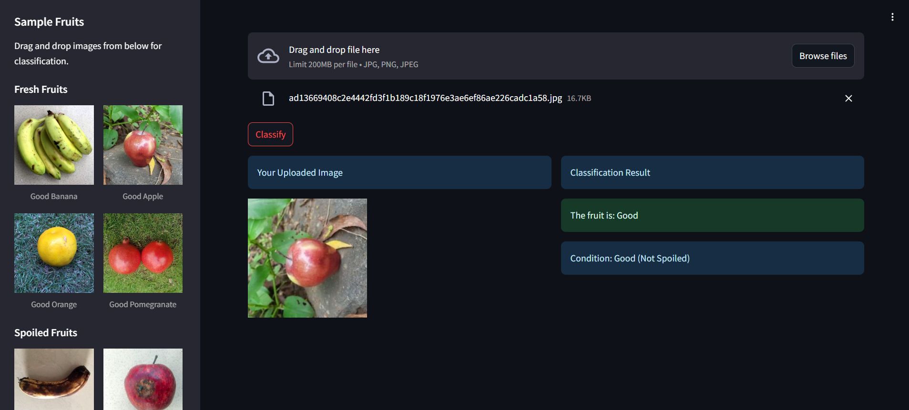
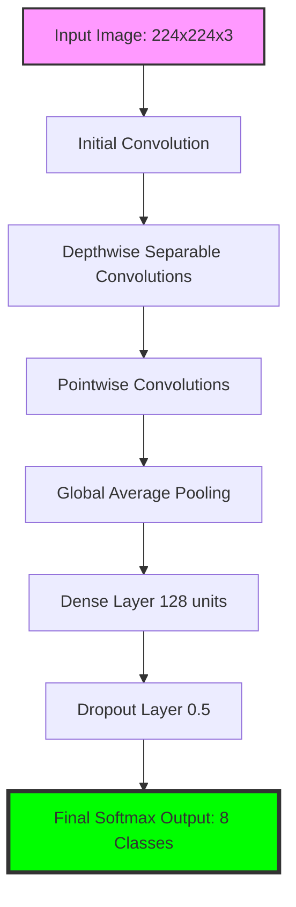

# Fruit Quality Detector

## Overview
Fruit Quality Detector is a web application that uses a machine learning model to classify fruits as either **Good** or **Spoiled**. This project demonstrates how TensorFlow and Keras can be used to build and deploy a fruit classification system on Streamlit.




## Hosted App
The application is live and hosted at:
[https://fruit-classify.onrender.com/](https://fruit-classify.onrender.com/)

## Key Learning
To successfully deploy this app on Streamlit, use TensorFlow and Keras version **2.15.0**.

## ✨ Features
- **Real-time Classification**: Instantly detect if a fruit is fresh or spoiled.
- **Multi-Fruit Support**: Specialized detection for Bananas, Apples, Oranges, and Pomegranates.
- **Interactive Sidebar**: Easy access to sample images for quick testing.
- **User-Friendly Interface**: Clean and intuitive web UI built with Streamlit.
- **Confidence Scoring**: View the model's certainty level for every prediction.

## 🧠 Deep Learning Model (CNN)

This project is built around a powerful **Convolutional Neural Network (CNN)** designed specifically for image classification task. CNNs are a class of deep neural networks, most commonly applied to analyzing visual imagery.

### 🌐 CNN Architecture Overview
The model follows a structured architecture optimized for both accuracy and performance. It leverages **MobileNetV2** as the base architecture, which is known for its efficiency in mobile and web applications.

1.  **Input Layer**: Accepts 224x224 pixel RGB images.
2.  **Convolutional Layers**: These layers use filters (kernels) to extract features like edges, textures, and eventually complex shapes (fruit features).
3.  **Activation Function (ReLU)**: Adds non-linearity to the model, allowing it to learn complex patterns.
4.  **Pooling Layers**: Reduces the spatial dimensions of the data, making the model more robust to small variations in the image.
5.  **Fully Connected (Dense) Layers**: The final layers that perform the classification into the 8 target categories (Good/Spoiled for different fruits).

### 📊 Model Graph
Below is a high-level representation of the model's data flow:



### 🧠 How it Works in this Application
The model doesn't just "see" the image; it processes it through several mathematical transformations:

*   **Preprocessing**: Each uploaded image is resized to **224x224 pixels** and normalized to a range of **[-1, 1]**. This ensures the model receives data in the same format it was trained on.
*   **Feature Extraction**: The early layers of the CNN detect simple features like the color and shape of the fruit. Deeper layers combine these to identify "freshness" markers vs "spoilage" markers (like dark spots or mold patterns).
*   **Classification**: The final layer outputs a probability distribution across 8 classes. The class with the highest probability is selected as the result.

## Tech Stack
- **Frontend**: Streamlit
- **Deep Learning Framework**: TensorFlow, Keras
- **Computer Vision**: Convolutional Neural Networks (CNN)
- **Base Architecture**: MobileNetV2
- **Image Processing**: PIL (Pillow), NumPy

## Installation Guide
Follow the steps below to run the project locally:

1. Clone the repository:
   ```bash
   git clone https://github.com/SimpleCyber/Fruit_Classification-IEEE.git
   ```
2. Navigate to the project directory:
   ```bash
   cd Fruit_Classification-IEEE
   ```
3. Install the required dependencies:
   ```bash
   pip install -r requirements.txt
   ```
4. Run the Streamlit app:
   ```bash
   streamlit run app.py
   ```

## Contribution
We welcome contributions! If you’re interested, please visit the GitHub repository:
[https://github.com/SimpleCyber/Fruit_Classification-IEEE.git](https://github.com/SimpleCyber/Fruit_Classification-IEEE.git)

## License
This project is licensed under the MIT License. See the [LICENSE](LICENSE) file for details.

---

✨ **Enjoy detecting fruit quality with ease!**

